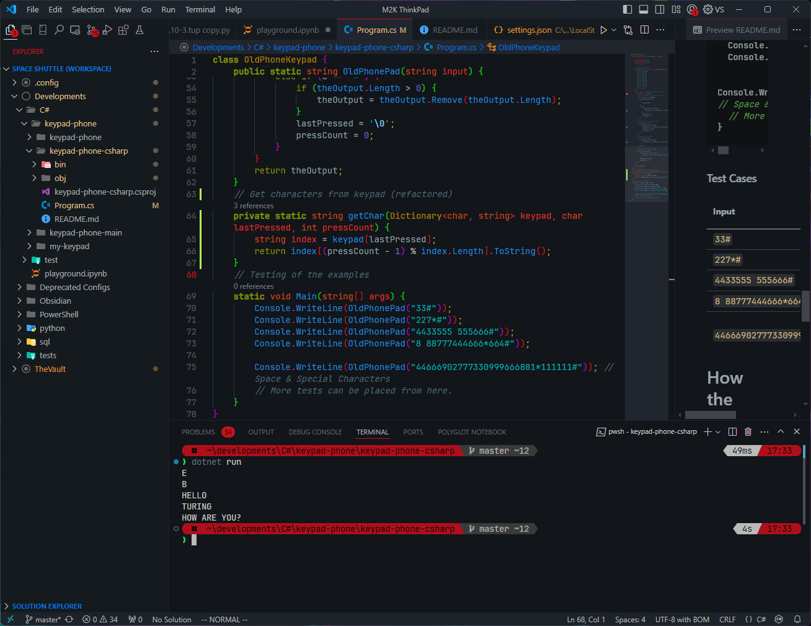

# Old keypad phone simulation in C#


This project simulates typing on an old keypad phone where each number on the keypad represents multiple letters. The input is processed according to how many times a key is pressed to produce the corresponding letter, plus the additional funtionalities such as special characters, Spacebar, Backspace and Send buttons.

# Contents
- [Features](#features)
- [Key Mapping](#key-mapping)
- [How to run](#how-to-run)
  - [Prerequsites](#prerequisites)
  - [Steps](#steps)
  - [Testing](#testing)
  - [Test Cases](#test-cases)
- [How the code works](#how-the-code-works)
  - [Flowchart]

# Features
- Simulates pressing buttons on an old phone keypad.
- The `*` key works as a `Backspace` to delete the last character.
- The `#` key works as `Enter` to end the put and returns the final result.
- The `0` key works as a `Spacebar`.
- The `1` key contains characters `!`, `@`, `&`, `(`, `)` and `?`.
- Supports character input like the keypad phone texting where pressing the same key multiple times cycles through the corresponding letter.

# Key Mapping
```
1 ► ! @ & ( ) ?
2 ► A B C
3 ► D E F
4 ► G H I
5 ► J K L
6 ► M N O
7 ► P Q R S
8 ► T U V
9 ► W X Y Z
0 ► Space
* ► Backspace
# ► End of input
```

# How to run
### Prerequisites
Make sure you have .NET SDK installed. You can download it from [here](https://dotnet.microsoft.com/download).

### Steps
1. Clone this repository or copy the code from `Program.cs`.
2. Create & open a directory in VS Code.
3. In the terminal, navigate to the directory and create a new console app:
	```powershell
	dotnet new console
	```
4. Replace the content of `Program.cs` with copied code from this project.
5. Run the program by executing the following command in the terminal.
	```powershell
	dotnet run
	```

### Testing
More tests can be placed from line number 70 of `Program.cs` and onwards.
```c#
static void Main(string[] args) {
  Console.WriteLine(OldPhonePad("33#"));
  Console.WriteLine(OldPhonePad("227*#"));
  Console.WriteLine(OldPhonePad("4433555 555666#"));
  Console.WriteLine(OldPhonePad("8 88777444666*664#"));

  Console.WriteLine(OldPhonePad("44666902777330999666881*111111#")); // Space & Special Characters
  // More tests can be placed from here.
}
```

### Test Cases
| Inputs                            | Expected Outputs |
| --------------------------------- | ---------------- |
| `33#`                             | E                |
| `227*#`                           | B                |
| `4433555 555666#`                 | HELLO            |
| `8 88777444666*664#`              | TURING           |
| `44666902777330999666881*111111#` | HOW ARE YOU?     |

# How the code works
The program reads a sequence of numbers, spaces and symbols as input. It uses a dictionary to map each key (from 1 to 9 & 0) to it's corresponding letter. If a number is pressed multiple times consecutively, it cycles through the letters associated with that key. A blank space `' '` will act as a pause, in order to type 2 characters from the same button after each other. The `*` acts as a `Backspace`, `0` acts as a `Spacebar` and the `#` acts as an `Enter`.

### Flowchart
```mermaid
graph TD
    A[Start] --> B[Initialize variables: theOutput, lastPressed, pressCount, keypad]
    B --> C[Loop through input string]
    C --> D{Is c a number key (2-9)?}
    D -- Yes --> E{Is lastPressed == c?}
    D -- No --> G{Is c a space?}
    
    E -- Yes --> F[Increment pressCount]
    E -- No --> I[Append mapped char to theOutput, update vars]
    
    F --> C
    I --> C
    
    G -- Yes --> H[Append mapped char to theOutput, reset vars]
    G -- No --> J{Is c a backspace (*)?}
    
    H --> C
    J -- Yes --> K[Remove last char from theOutput, reset vars]
    J -- No --> L{Is c a send button (#)?}
    
    K --> C
    L -- Yes --> M[Append final char to theOutput and End]
    L -- No --> C

```